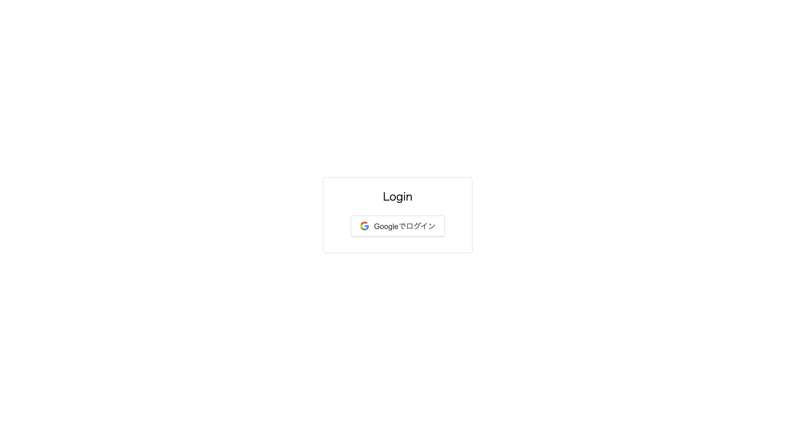
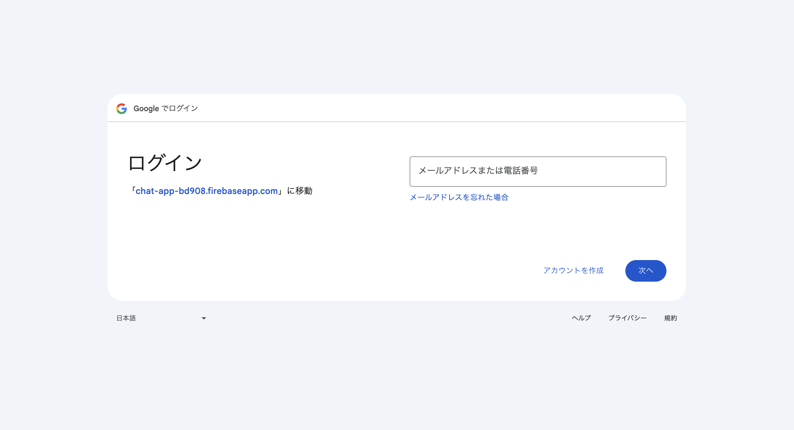
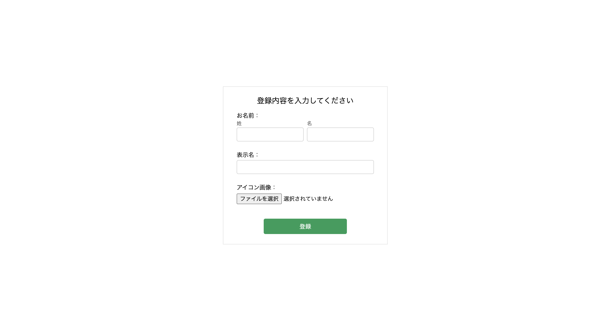
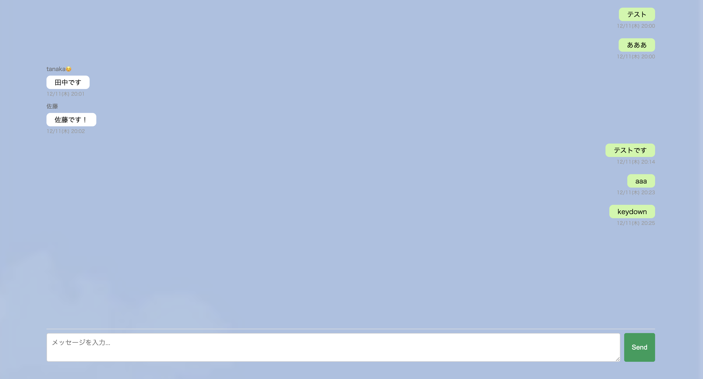

# ①課題名
LINE風チャット

## ②課題内容（どんな作品か）
- LINEのように相手とメッセージのやり取りができるチャット。
- 新規ログイン時にアカウント情報を設定し、チャット画面に遷移する流れ（2回目ログイン以降はアカウント情報の設定が出ないように設定）。
- チャット画面はLINEのUIと同じように、左側に自分以外の人からのメッセージ、右側に自分の送ったメッセージが表示される。

## ③アプリのデプロイURL
https://maru1192.github.io/gs_1212_chat/

## ⑤工夫した点・こだわった点
- よりリアルな利用のフローを意識して、グーグル認証機能と登録フォームを導入し、誰がメッセージを送ったのか分かるようにした点。
- メッセージを送信した時間も表示されるようにした点。
- よりLINEのチャット画面のUIをリアルに再現しようとした点
- メッセージをエンターキーでも送信できるようにした点

## ⑥難しかった点・次回トライしたいこと（又は機能）
- チャットにユーザーのアイコンを入れたかったが、firebaseのstorageを使うには費用がかかることが分かり、途中で断念してしまったので、いずれは実装したいです。
- テキストだけでなく、スタンプや画像も送れるようにして、よりリアルなチャット機能の実現を目指したいです。
- ログイン済みの時に、一度ページを閉じ再度開こうとすると、ログイン画面が一瞬出てからチャット画面が出るようになってしまっているので、ここも修正を加えていきたいです。
- 今回は1チャットグループにしか入れないので、スレッドのように自由にチャットグループが作れるようにしたいです。

## ⑦フリー項目（感想、シェアしたいこと等なんでも）
- auth.currentUserで現在ログインしているユーザーを取得 + firebaseに送った情報の中のユーザーidが一緒　→→つまり、自分（現在ログインしている人）のメッセージと判別することは可能だと知り、なるほどと思いました。
- e.やfunction(e)のeって何者？と思ってたのですが、今回少しだけ理解することができた気がします！
